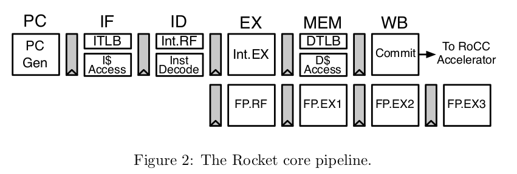
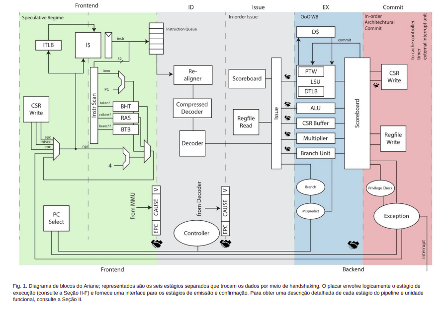
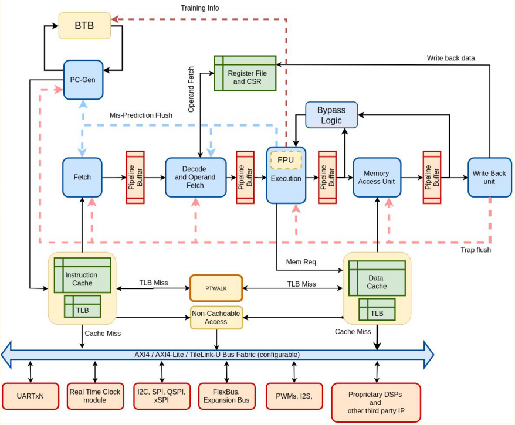

Este artigo busca realizar uma comparação entre as principais implementações
de RISCV, são eles os chips: Rocket, BOOM, Ariane (CVA6) e SHAKTI Classe C.

<!--more-->

## Introdução

RISC-V é uma nova arquitetura de conjunto de instruções
(ISA) que foi criada na Universidade da Califórnia em Berkeley
como um projeto de pesquisa e educação em arquitetura
de computadores, atualmente vem ganhando cada vez
mais implementações por parte da indústria. Ela foi desenvolvida
com o objetivo de ser aberta, livre e acessível,
de forma a permitir que qualquer pessoa possa usar, modificar
e implementar a arquitetura sem restrições ou custos
adicionais. A ISA foi projetada para suportar espaços de endereçamento
de 32 bits, 64 bits e 128 bits, visando aumentar a
sua adoção. Essa flexibilidade permite que a arquitetura RISCV
seja utilizada em uma ampla variedade de aplicações, desde
dispositivos de baixo consumo de energia até sistemas de alto
desempenho. Ao suportar diferentes tamanhos de palavra,
a ISA RISC-V oferece maior versatilidade para atender às
necessidades específicas de cada projeto, permitindo um uso
eficiente dos recursos disponíveis. Essa abordagem modular
contribui para a popularidade e a crescente aceitação da
arquitetura RISC-V em diversas indústrias e setores.

RISC-V é uma arquitetura que permite que qualquer pessoa
ou organização crie suas próprias implementações. Devido
a esse fato, este artigo tem como objetivo apresentar e
comparar as principais implementações.
Ele possui 3 sessões, primeiro será apresentado as implementações,
seguido pela comparação, e por fim, a conclusão.

## Implementações

Para a escolha das implementações a serem apresentadas,
foram pesquisadas implementações robustas e avançadas, que fossem
capazes de executar um SO (Sistema Operacional) em uma placa FPGA.
Para este cenário foram escolhidas:
Ariane (CVA6)[4], Boomv3[5], Rocket[1] e Shakti[2].

### Rocket Chip[*](https://github.com/chipsalliance/rocket-chip)

O Rocket Chip é um projeto de desenvolvimento de processador que
foi criado na Universidade da Califórnia, em Berkeley.
Ele desempenha um papel importante como uma implementação inicial
e serve a várias finalidades dentro do campo de computação.
O principal objetivo do Rocket Chip é atuar como uma espécie de
modelo de referência para processadores baseados no conjunto de instruções RISC-V (ISA).
O Rocket Chip é uma criação importante que desempenha várias funções:
é uma referência para processadores RISC-V, uma biblioteca de código aberto e
uma plataforma de testes para novas ideias e desenvolvimentos relacionados a processadores.

Ele é um processador escalar em ordem com um pipeline de 5 estágios,
ou seja, é um tipo de unidade de processamento central em um computador.
*Escalar* se refere a executar uma instrução por vez,
e *ordem de 5 estágios* se refere aos passos que o processador segue
para executar cada instrução.
Esses passos são divididos em cinco etapas distintas:
busca (pegar a próxima instrução), decodificação (entender o que a
instrução faz), execução (realizar a operação da instrução),
acesso à memória (lidar com informações armazenadas)
e escrita de volta (atualizar os resultados).

#### Pipeline

Possui um pipeline clássico de 5 estágios,
como já descritos anteriormente.
Inclui uma área de armazenamento temporário (cache) para
dados e instruções, que pode ser rápida ou mais devagar.
As caches do tipo L1 e L2 podem ser ajustadas conforme a necessidade.
Para adivinhar para onde um ramo (um tipo de decisão) deve ir,
ele usa um conjunto de recursos configuráveis,
como uma *máquina de prever o futuro*,
incluindo um Buffer de Destino de Ramificação (BTB),
uma Tabela de Histórico de Ramificação(BHT)
e uma lista de lugares aonde ele pode voltar depois de tomar uma decisão (RAS).
Além disso, há uma parte chamada Buffer de Pesquisa de Tradução (TLB),
que ajuda a traduzir códigos e dados em informações que o processador
possa entender mais rapidamente,
o que ajuda a fazer o computador funcionar mais rápido em geral.

### BOOMv3 (SonicBOOM)[*](https://github.com/riscv-boom/riscv-boom)

O BOOMv3, também conhecido como SonicBOOM, é um projeto de processador
desenvolvido pela Universidade da Califórnia em Berkeley.
Ele é projetado para ser superescalar fora de ordem,
o que significa que pode executar várias instruções em paralelo,
independentemente da ordem em que foram escritas no programa.
Isso geralmente resulta em um alto desempenho,
pois permite que o processador aproveite melhor os recursos disponíveis.
O pipeline do BOOMv3 tem 10 estágios, o que significa que as instruções
percorrem uma série de etapas separadas enquanto são processadas.
Isso ajuda a dividir o trabalho em partes menores e
a aumentar a eficiência do processador. No entanto,
quando ocorre um erro de previsão de ramificação (*misprediction*),
há uma penalidade de 12 ciclos, o que significa que o processador
pode precisar de um tempo extra para se recuperar de um erro.

O projeto BOOMv3 é considerado ambicioso, pois é destinado à
computação de alto desempenho.
Ele é especialmente adequado para uso em clusters de computadores e servidores,
onde o poder de processamento é crítico.
Clusters são conjuntos de computadores interconectados que
trabalham juntos para lidar com tarefas complexas,
e os servidores são computadores dedicados a fornecer serviços,
como hospedagem de sites ou armazenamento de dados.
Portanto, o BOOMv3 é otimizado para lidar com cargas de trabalho intensivas
e é uma escolha popular para cenários em que o desempenho é primordial.

#### Pipeline

O BOOM apresenta um pipeline que pode ser descrito como complexo e robusto.
Isso significa que ele é capaz de gerenciar tarefas variadas
e desafiantes de forma eficaz.
O BOOM também é configurável e personalizável,
o que permite que os desenvolvedores adaptem o processador de acordo
com as necessidades específicas de suas aplicações.

Um detalhe importante é o TLB (Buffer de Pesquisa de Tradução),
que ajuda a traduzir os códigos e instruções em informações que o
processador possa entender mais rapidamente, melhorando o desempenho geral.
Outra característica notável do BOOM é a maneira como lida com
previsões de ramificação (decisões sobre qual caminho um programa seguirá).
Ele utiliza preditores complexos de dois níveis baseados em
vetores de histórico global, conhecidos como GShare ou TAGE.
Esses preditores são uma espécie de *máquina de adivinhar* que ajuda
o processador a antecipar decisões de ramificação, melhorando a eficiência.

O BOOM também oferece suporte à especulação completa de ramificação.
Isso significa que ele pode tomar decisões arriscadas sobre caminhos a seguir
e corrigir caso essas decisões estejam erradas.
Isso é feito usando um conjunto de recursos que inclui o
BTB (Buffer de Destino de Ramificação),
a BHT (Tabela de Histórico de Ramificação), o TLB
e o RAS (Pilha de Endereços de Retorno).

Além disso, existe uma parte chamada
uBTB (Buffer de Destino de Ramificação Simplificado),
também conhecida como *next-line-predictor* ou *L0 BTB*.
Isso funciona como um atalho para pequenos loops, redirecionando o
próximo endereço de instrução de forma mais rápida,
o que melhora muito a velocidade de execução em situações específicas.

### Ariane (CVA6)[*](https://github.com/openhwgroup/cva6)

O CVA6 é uma implementação de processador desenvolvida pelo grupo HW,
que é uma organização global dedicada à criação de hardwares de
código aberto e livres.
Isso significa que o projeto do CVA6 é acessível a todos,
permitindo que as pessoas o estudem, modifiquem e usem conforme necessário.

Ele é um processador superescalar fora de ordem,
o que significa que ele pode executar múltiplas instruções ao mesmo tempo
e não necessariamente na ordem em que foram escritas no programa.
Ele possui um pipeline de 6 estágios e pode ser comparado ao pipeline do
Rocket Chip, que tem 5 estágios, mas com um estágio adicional para
o Program Counter (PC).
O Program Counter é um registrador especial que armazena o endereço da
próxima instrução a ser executada.
No caso do CVA6, esse processo é tratado como uma fase separada no pipeline,
o que pode trazer vantagens em termos de eficiência e desempenho.
Essa abordagem de incorporar o processo do PC como uma fase do pipeline
é uma característica distintiva do CVA6, que pode influenciar
positivamente o desempenho geral do processador em certos cenários de uso.

#### Pipeline

O Ariane (CVA6) é ajustável conforme a demanda e equipado com componentes
especializados para aprimorar diversas tarefas-chave.
Uma das suas partes distintivas é o PTW (Caminhador da Tabela de Páginas),
que desempenha o papel de um tradutor inteligente.
Quando um endereço não é localizado na TLB (Buffer de Tradução de Endereço),
o PTW entra em ação.
Funciona como um guia versátil que consulta a memória principal,
realizando a tradução do endereço virtual para o físico e, posteriormente,
adiciona a entrada correspondente na TLB.
A sua atuação é crucial para agilizar o processo de acesso à memória,
otimizando a eficiência da busca de informações.

Outro aspecto notável é a capacidade de previsão de ramificações.
Esse mecanismo de previsão é respaldado por um conjunto de recursos,
incluindo o BTB (Buffer de Destino de Ramificação),
que atua como um direcionador de possíveis escolhas.
Além disso, a BHT (Tabela de Histórico de Ramificação)
é como um diário que registra padrões anteriores de decisões,
contribuindo para uma abordagem mais precisa.
Complementando essa funcionalidade, o TLB e o RAS (Pilha de Endereços de Retorno)
também desempenham papéis fundamentais na preparação para eventos futuros,
possibilitando um processamento mais eficiente e previsível.

### Shakti Classe C[*](https://shakti.org.in/)

O SHAKTI é um projeto de código aberto iniciado pelo
Instituto Indiano de Tecnologia de Madras.
Ele tem como objetivo criar processadores avançados que possam
ser acessíveis e personalizáveis para diversas aplicações.
A Classe C é um dos membros da família de processadores SHAKTI.
Essa família de processadores visa oferecer opções variadas
para diferentes necessidades.
O processador Classe C é um exemplo notável dessa família.
Ele é do tipo *escalar em ordem* e possui um pipeline de 5 estágios.

O que o torna ainda mais especial é que ele é o membro mais avançado
da linha de processadores SHAKTI.
Isso significa que ele incorpora os aprimoramentos
e as características mais recentes desenvolvidas pela equipe do projeto.
Ele representa o ápice da evolução dessa linha de processadores,
garantindo um desempenho aprimorado e recursos mais sofisticados.

#### Pipeline

Com base nas implementações mencionadas anteriormente,
este processador apresenta as características mais essenciais e fundamentais.
Seu pipeline adota uma abordagem simples de 5 estágios,
com estruturas clássicas aplicadas para otimizar o processamento.
No âmbito da previsão de desvios, ele se beneficia das funcionalidades do
BTB, BHT e RAS, ferramentas que colaboram para antecipar
escolhas de ramificação e otimizar a execução.

Uma particularidade notável é que este processador possui caches L1 separados, 
que funcionam como áreas de armazenamento temporário para dados frequentemente utilizados,
contribuindo para um acesso mais ágil e eficaz.
Além disso, suas TLBs associativas separadas desempenham o papel de
traduzir endereços virtuais em endereços físicos de memória,
otimizando ainda mais o desempenho global.
Este processador se destaca por sua simplicidade em comparação com as
implementações anteriores, tornando-o mais direto em suas operações.
Ele é considerado o mais elementar entre os processadores mencionados previamente.
A flexibilidade também é uma característica fundamental,
pois pode ser configurado e adaptado conforme as necessidades,
permitindo ajustes específicos de acordo com diferentes cenários.

## Comparação

|              | Rocket   | BOOMv3   | Ariane   | Shakti   |
| ---          | :---:    | :---:    | :---:    | :---:    |
| Bits         | 32/64    | 64       | 64       | 32/64    |
| Stages       | 5        | 10/12    | 6        | 5        |
| Funct. Units | 4        | 8        | 6        | 3        |
| DMIPS        | 1,71 MHz | 3,87 MHz | 1,21 MHz | 1,70 MHz |
| Tech         | 45nm     | 45nm     | 22 nm    | 22 nm    |
| Speed        | 1,6 GHz  | 1,5 GHz  | 1,7 GHz  | 0,8 GHz  |
| Area         | 0,5 mm²  | 1,7 mm²  | 0,3 mm²  | 0,29 mm² |
| Power        | 125 mW   | 300 mW   | 52 mW    | 90 mW   |

Utilizando como parametro a quantidade de MIPS relatada,
a literatura considera que BOOM lidera o critério de desempenho
por MHz e ultrapassa todos os outros em mais de um fator de 2.
Seguido por Rocket, SHAKTI e CVA6 seguem na ordem mencionada.

BOOM também se destaca como sendo a implementação mais complexa,
com maior área e consumo. Tudo isso deve-se ao fato, da sua
estrutura superescalar, paralelismo e capacidade de execução.
Por outro lado, caberiam 4 núcleos do Rocket em um do BOOM,
o mesmo pode ser dito das outras implementações, dependendo do
projeto pode ser mais interessante vários núcleos de baixo consumo
que um muito eficiente.

Shakti e Arine são implementações pequenas, com baixo consumo e
eficientes. Ariane consegue ser superior em alguns quesitos.
Já os outros modelos não conseguem ser pequenos ou economicos.
O BOOM de longe é que o apresenta o maior consumo e área
de silicio.

Outro ponto relevante, é que com exceção do Shakti,
todas as implementações apresentam velocidade de processamento
semelhantes.

## Conclusão

Todas as implementações têm suas vantagens e desvantagens,
elas atendem a públicos diferentes com necessidades diferentes.

A implementação Rocket se destaca pelo pionerismo, simplicidade e
eficiência. Foi a primeira implementação, serve como debugguer da ISA,
molde e referência no surgimento de novas placas.
Assim como, queridinha das publicações e da academia.

BOOM, se destaca por ser a implementação mais robosta e eficiente.
Voltada para a computação de alto desempenho e suas necessidades.

Ariane por sua vez, se destaca pelo tamanho e consumo.
Projetada para atender a requisitos de
desempenho e eficiência energética.

Por fim, o núcleo Shakti é projetado para sistemas de computação
de médio porte e possui características adequadas para essa finalidade.
Ela é simples e eficiente.

## Referências

[1] Krste Asanović et al.2016.The Rocket Chip Generator. TechnicalReport UCB/EECS-2016-17. Department of Electrical Engineering &Computer Sciences, University of California, Berkeley, CA, USA.

[2] Gurajala Bhavitha Chowdary. 2022.Set Associative Data TLB for ShaktiC-Class Processor. Ph. D. Dissertation. Indian Institute of TechnologyMadras.

[3] Alexander Dörflinger, Mark Albers, Benedikt Kleinbeck, Yejun Guan,Harald Michalik, Raphael Klink, Christopher Blochwitz, Anouar Nechi,and Mladen Berekovic. 2021.  A comparative survey of open-sourceapplication-class RISC-V processor implementations. InProceedings ofthe 18th ACM International Conference on Computing Frontiers. ACM. https://doi.org/10.1145/3457388.3458657

[4] Florian Zaruba and Luca Benini. 2019. The Cost of Application-ClassProcessing: Energy and Performance Analysis of a Linux-Ready 1.7-GHz 64-Bit RISC-V Core in 22-nm FDSOI Technology.IEEE Transac-tions on Very Large Scale Integration (VLSI) Systems27, 11 (nov 2019),2629–2640. https://doi.org/10.1109/tvlsi.2019.2926114

[5] Jerry Zhao, Ben Korpan, Abraham Gonzalez, and Krste Asanovic. 2020.SonicBOOM: The 3rd Generation Berkeley Out-of-Order Machine.Fourth Workshop on Computer Architecture Research with RISC-V(May2020).

## Glossário

- **Buffer de destino de ramificação (BTB)**: armazena o endereço de destino de cada instrução de ramificação que é executada.
- **Buffer de pesquisa de tradução (TLB)**: é uma pequena memória associativa que armazena traduções de endereços virtuais para endereços físicos.
- **Cache**: é uma área de armazenamento rápido que é usada para armazenar cópias de dados que são acessados com frequência.
- **Caminhador da tabela de páginas (PTW)**: é um componente da unidade de gerenciamento de memória (MMU) de um processador. O PTW é responsável por traduzir endereços virtuais em endereços físicos.
- **Pilha de endereços de retorno (RAS)**: é usada para manter o controle do fluxo de execução do programa e garantir que as funções sejam chamadas na ordem correta.
- **Tabela de histórico de ramificação (BHT)**: é uma tabela que armazena o endereço de destino de cada instrução de ramificação que foi executada, bem como o endereço da instrução anterior que a causou.
