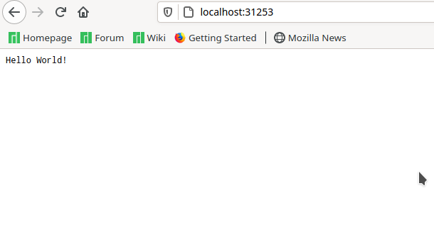

This tutorial shows you how to create a cluster for processors of the Power architecture (ppc64/ppc64le) using Minikube.

<!--more-->

The tutorial was performed on Ubuntu 20.04 LTS (ppc64le), the packages were downloaded using the package repository from [OpenPower Lab @ Unicamp](https://openpower.ic.unicamp.br/project/power-repository/).

## Dependencies

The following packages are required:
- Minikube
- Kubectl
- Docker-ce
- Conntrack

You can use the commands below to solve the dependencies:

```bash
apt-get update
apt-get install docker-ce conntrack minikube kubectl
```
> It may be necessary to add the repository from [OpenPower Lab @ Unicamp](https://openpower.ic.unicamp.br/project/power-repository/) in your sistems.

> Optionally, Kubeadm and Kubelet can be installed.

## Create a minikube cluster

1. Start Minikube

```bash
sudo minikube start --driver=none
```

> The default drive is Docker, however the minikube does not recognize that Docker is available for ppc64le architecture and has an error.

To make 'none' the default drive, use the command:

```bash
sudo minikube config set driver none
```

> You may need to run the command:: `sudo sysctl fs.protected_regular=0`

2. Check Status

```bash
sudo minikube status
```

Output is similar to:

```bash
minikube
type: Control Plane
host: Running
kubelet: Running
apiserver: Running
kubeconfig: Configured
```

3. Open the Kubernetes dashboard in a browser

```bash
sudo minikube dashboard
```

## Create a Deployment

There are two structures in Kubernetes: Pod and Deployment. Pod can be a group of one or more containers, while a Deployment checks, manages and restarts the pods. That is, the deployment is recommended when it will be used in a large group of pods.

1. Create a Deployment

```bash
sudo kubectl create deployment hello-node --image=minicloud/node-server
```

> *[minicloud/node-server](https://hub.docker.com/r/minicloud/node-server)*: is a public docker image created for the ppc64le architecture. The files used to build the image are in the [GitHub](https://github.com/Unicamp-OpenPower/nodeServer).

2. View the Deployment:

```bash
sudo kubectl get deployments
```

The output is similar to:

```bash
NAME         READY   UP-TO-DATE   AVAILABLE   AGE
hello-node   1/1     1            1           6m28s
```

3. View the Pod:

```bash
sudo kubectl get pods
```

The output is similar to:

```bash
NAME                          READY   STATUS    RESTARTS   AGE
hello-node-5dd47b76c8-l5vs2   1/1     Running   0          6m51s
```

## Create a Service

In order to be able to directly access the Pod, it is necessary to create a service.

1. Create a Service

```bash
sudo kubectl expose deployment hello-node --type=NodePort --port=8080
```

2. View the Service

```bash
sudo kubectl get services
```

The output is similar to:

```bash
NAME         TYPE        CLUSTER-IP       EXTERNAL-IP   PORT(S)          AGE
hello-node   NodePort    10.102.223.224   <none>        8080:31253/TCP   8s
kubernetes   ClusterIP   10.96.0.1        <none>        443/TCP          14m
```
Open the service in the browser: [http://localhost:8080/](http://localhost:8080/).



> If it is not possible to access this port, change the 8080, for the 5 digit port that appears in the view. In that case it would be port 31253.

## Clean up

Now you can clean up the resources you created in your cluster:

```bash
kubectl delete service hello-node
kubectl delete deployment hello-node
```

Optionally, stop the Minikube:

```bash
minikube stop
```

Optionally, delete the Minikube:

```bash
minikube delete
```

## Tutorial for others architectures

[Hello Minikube](https://kubernetes.io/docs/tutorials/hello-minikube/)
